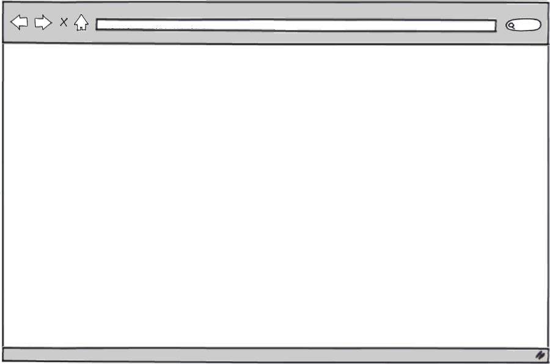
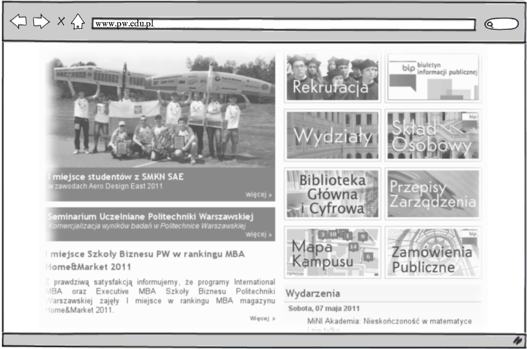

!SLIDE bullets incremental

# Internet: how does it work?

* well, I sit at my computer…
* …or a laptop…
* …or a tablet…
* …or a phone…
* …and, um, browse websites!

!SLIDE

# Internet: how does it work?

!SLIDE

# Internet: how does it work?

!SLIDE

# Internet: how does it work?

!SLIDE bullets incremental

# Internet: not only WWW

* that was actually World Wide Web
* there are other Internet services:
* email
* chat
* voice &amp; video
* (and other still)

!SLIDE

# client-server model

!SLIDE bullets incremental

# client-server model

* browser, email, chat: client
* ‘somewhere over there’: server
* various protocols: HTTP, IMAP, XMPP
* request / response cycle

!SLIDE bullets incremental

# WWW: HTML over HTTP!

* World Wide Web
* =
* HyperText Transfer Protocol
* +
* HyperText Markup Language
* (mostly)

!SLIDE bullets incremental

# WWW: how does it work?

* user comes up with a URL like `http://www.pw.edu.pl/mapa`
* puts it in the browser
* the browser asks the DNS server ‘where is the `www.pw.edu.pl` domain hosted?’
* DNS server replies ‘there: `194.29.151.5`’
* browser asks `194.29.151.5` for `/mapa` and gets HTML
